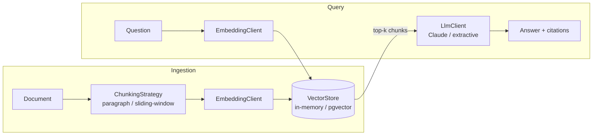

# Enterprise RAG

**Retrieval-augmented generation platform for enterprise knowledge bases**, built with Java 21 and Spring Boot. Ingest internal documents, retrieve with vector similarity search, and generate **citation-grounded answers** — the model is constrained to the retrieved passages and must say so when they don't contain the answer.

## Architecture



Every pipeline stage is an interface with swappable implementations (strategy pattern), selected by configuration:

| Stage | Interface | Implementations |
|---|---|---|
| Chunking | `ChunkingStrategy` | `ParagraphChunker` (semantic units), `SlidingWindowChunker` (overlapping windows) |
| Embedding | `EmbeddingClient` | `HashingEmbeddingClient` (deterministic, zero-infra); drop-in point for transformer embeddings |
| Storage | `VectorStore` | `InMemoryVectorStore` (default), `PgVectorStore` (pgvector + cosine index, `postgres` profile) |
| Generation | `LlmClient` | `AnthropicLlmClient` (Claude, grounded + cited), `ExtractiveLlmClient` (offline fallback) |

This is the property that matters in an enterprise setting: the same pipeline runs with zero infrastructure on a laptop and against Postgres/pgvector + Claude in production, with **no code changes — only configuration**.

### Grounding contract

The generation prompt enforces three rules: answer only from the numbered context passages, cite passages inline as `[n]`, and explicitly say when the context is insufficient rather than guessing. Every response carries its citations (document, chunk, similarity score) so answers are auditable.

## API

```bash
# ingest a document
curl -s localhost:8080/api/documents \
  -H 'Content-Type: application/json' \
  -d '{"title": "Expense Policy", "content": "Reimbursable expenses must be submitted within 60 days. Meals are capped at $75/day during travel..."}'
# => {"documentId": "5f0c...", "chunkCount": 4, "totalIndexedChunks": 132}

# ask a question
curl -s localhost:8080/api/query \
  -H 'Content-Type: application/json' \
  -d '{"question": "What is the daily meal cap when traveling?", "topK": 5}'
# => {"answer": "Meals are capped at $75 per day during travel [1].",
#     "citations": [{"documentTitle": "Expense Policy", "sequence": 1,
#                    "snippet": "...", "score": 0.412}],
#     "retrievalMs": 3}
```

## Quickstart

Requires JDK 21 and Maven.

```bash
git clone https://github.com/harshpatel262/enterprise-rag && cd enterprise-rag

# zero-infrastructure mode: in-memory vector store + offline extractive answers
mvn spring-boot:run

# with Claude-generated answers
ANTHROPIC_API_KEY=sk-ant-... mvn spring-boot:run

# production-style: pgvector + Claude
docker compose up -d
ANTHROPIC_API_KEY=sk-ant-... mvn spring-boot:run -Dspring-boot.run.profiles=postgres
```

Run the tests (offline, no database or API key):

```bash
mvn test
```

## Configuration

All knobs live under `rag.*` in `application.yml`:

| Property | Default | Description |
|---|---|---|
| `rag.chunker` | `paragraph` | `paragraph` or `sliding-window` |
| `rag.chunk-size` | `1200` | Max characters per chunk |
| `rag.chunk-overlap` | `200` | Overlap (sliding-window only) |
| `rag.default-top-k` | `5` | Retrieval depth |
| `rag.anthropic-api-key` | `${ANTHROPIC_API_KEY}` | Blank → offline extractive answers |
| `rag.model` | `claude-sonnet-4-6` | Generation model |

## Design notes

- **Why a hashing embedder as the default?** It makes the entire pipeline deterministic and self-contained: ingestion, retrieval ranking, and the grounding contract are all integration-tested with no network or GPU. It captures lexical similarity only; production deployments swap in a transformer `EmbeddingClient` — one bean, nothing else changes.
- **Why no embedding returned from pgvector search?** Query results only need text + score; embeddings stay in the database, keeping responses small.
- **Why interfaces everywhere?** Not abstraction for its own sake — each seam (chunking, embedding, storage, generation) is a real axis of variation between local dev, evaluation, and production.

## Roadmap

- [ ] Hybrid retrieval (BM25 + vector) with reciprocal rank fusion
- [ ] Transformer embedding client (ONNX runtime, local inference)
- [ ] Retrieval evaluation harness (recall@k against a labeled question set)
- [ ] Incremental re-indexing on document update

## License

MIT
